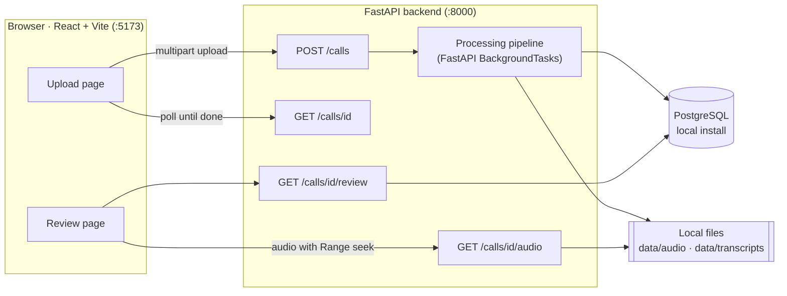
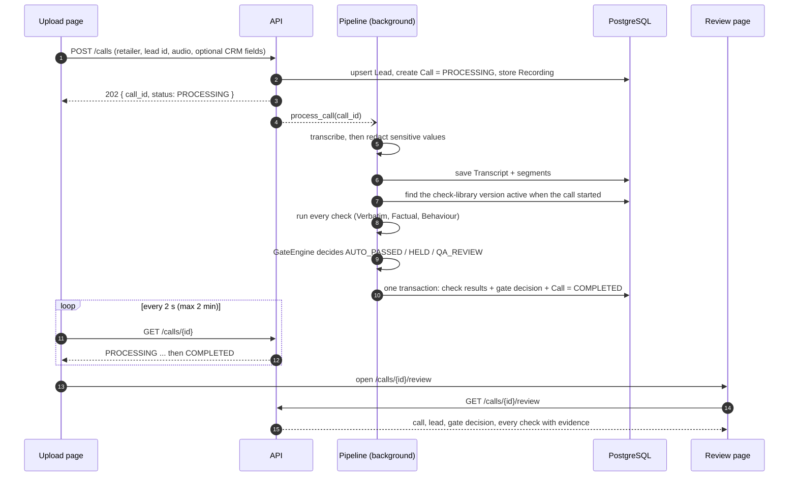
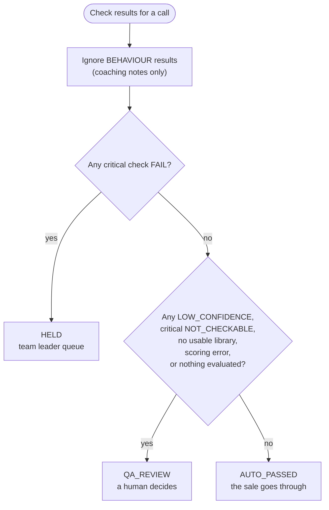
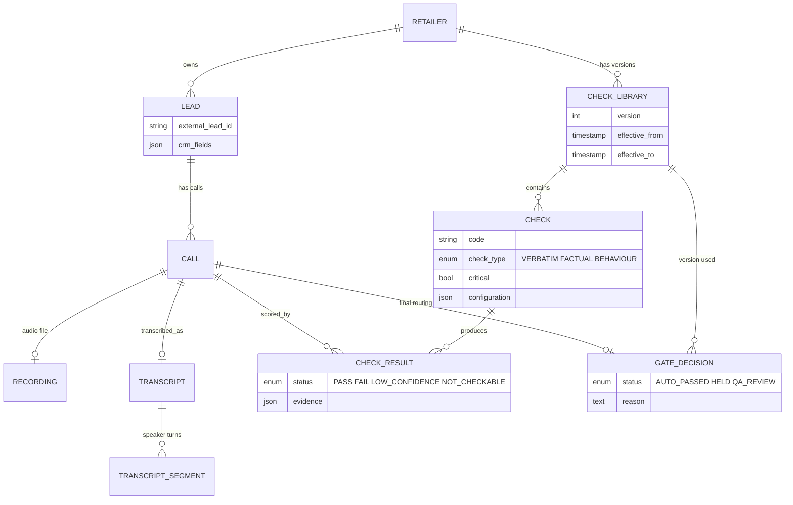
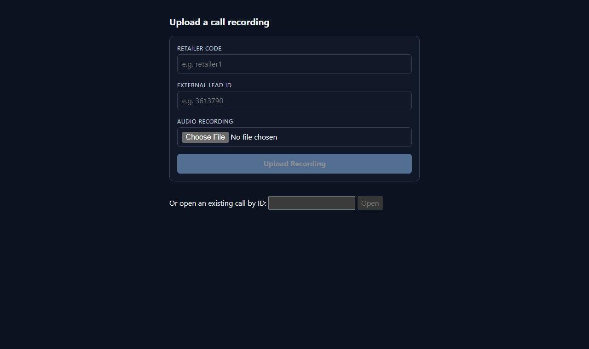
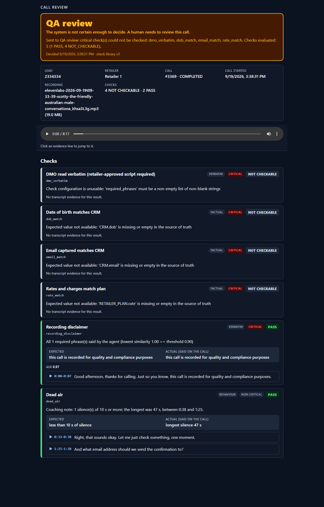
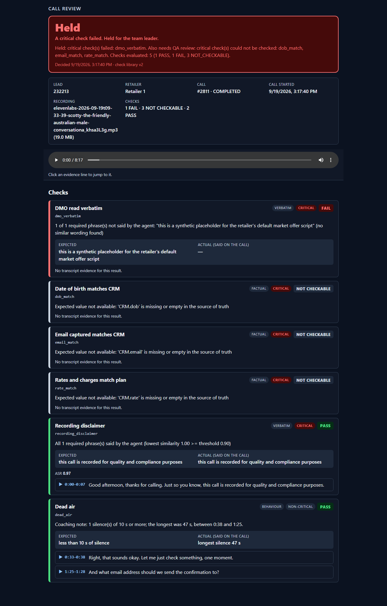
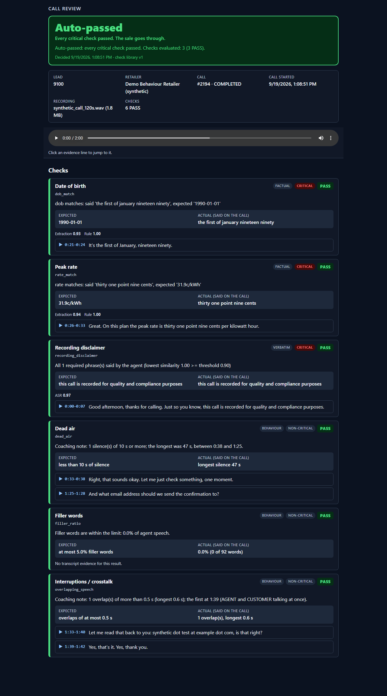
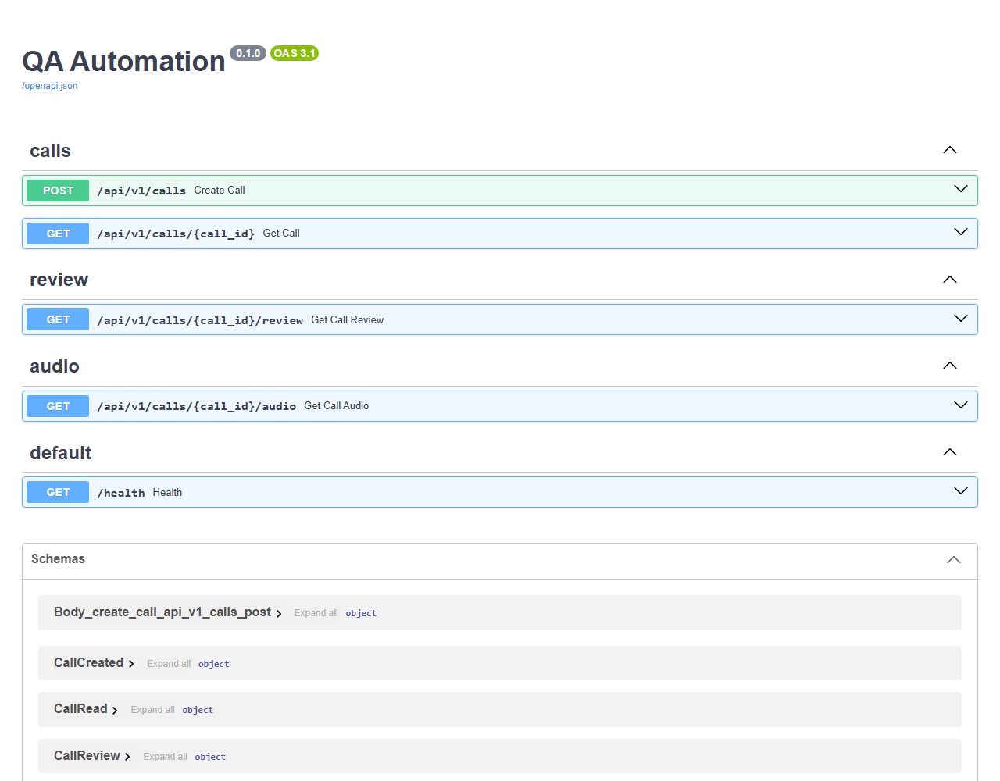

# QA Automation: sales-call QA gate

Every sales call is recorded, transcribed, **scored against a versioned, per-retailer check library**, and then
routed by a **gate** before the sale goes through:

| Gate decision | Meaning |
|---|---|
| **AUTO_PASSED** | every critical check passed: the sale goes through |
| **HELD** | a critical check definitely failed: held for the team leader |
| **QA_REVIEW** | the system is not certain enough to decide: a human reviews the call |

Uncertainty is never turned into a pass. A team leader opens a call in the React review page, sees the decision, every
check with its evidence, and can click an evidence line to jump to that moment in the recording.

**Stack:** FastAPI + SQLAlchemy 2 + Alembic + **PostgreSQL** (a plain local install, no Docker) · React 19 + Vite ·
pytest and vitest.

> **Demo status.** Transcription is a *fixture*: the STT provider returns a canned synthetic transcript whatever audio
> you upload (the swap point for a real provider is isolated, see [What the code does](#what-the-code-does)). The demo
> check library uses illustrative wording, not a retailer's approved scripts.

## Contents

1. [How it fits together](#how-it-fits-together)
2. [Repository structure](#repository-structure)
3. [What happens to a call](#what-happens-to-a-call)
4. [The gate](#the-gate)
5. [Data model](#data-model)
6. [Run it on your machine](#run-it-on-your-machine)
7. [What the code does](#what-the-code-does)
8. [Screenshots](#screenshots)
9. [API reference](#api-reference)
10. [Configuration](#configuration)
11. [Deploying the backend to Render](#deploying-the-backend-to-render)
12. [Not built yet](#not-built-yet)

## How it fits together



In development the Vite server proxies `/api` to the backend, so the browser only ever talks to the Vite server (port 5173).

## Repository structure

```
qa-automation/
├── backend/
│   ├── app/
│   │   ├── main.py                 # FastAPI app, CORS, /health, mounts the three routers
│   │   ├── config.py               # Settings from environment / .env (only DATABASE_URL is required)
│   │   ├── db.py                   # SQLAlchemy engine, SessionLocal, Base
│   │   ├── api/                    # HTTP layer
│   │   │   ├── calls.py            #   POST /calls, GET /calls/{id}
│   │   │   ├── review.py           #   GET /calls/{id}/review
│   │   │   └── audio.py            #   GET /calls/{id}/audio (HTTP Range)
│   │   ├── models/                 # SQLAlchemy tables (see Data model)
│   │   ├── schemas/                # Pydantic: CheckResult contract, call and review payloads
│   │   ├── repositories/           # BaseRepository + retailer/check-library lookup
│   │   └── services/
│   │       ├── calls/              #   processing_service: the pipeline entry point
│   │       ├── transcription/      #   provider interface + fixture provider
│   │       ├── redaction/          #   masks sensitive values (card numbers) in transcripts
│   │       ├── checks/             #   Verbatim / Factual / Behaviour runners and helpers
│   │       ├── scoring/            #   runs every check of the call's library version
│   │       ├── gate/               #   GateEngine (pure rules) + GateService (persists)
│   │       └── storage/            #   AudioStorage interface (local disk now, blob later)
│   ├── alembic/                    # migrations
│   ├── scripts/load_check_library.py   # load a check library JSON into the database
│   ├── data/fixtures/              # demo check libraries + the synthetic transcript
│   ├── tests/                      # pytest, against a real PostgreSQL
│   ├── requirements.txt
│   └── .env.example
├── frontend/
│   └── src/
│       ├── App.tsx                 # tiny router: upload page or /calls/{id}/review
│       ├── api/client.js           # fetch client, polling, friendly errors
│       ├── components/             # UploadCall, LeadReview, CheckResult, AudioPlayer
│       └── lib/format.js           # time / size formatting
├── data/                           # local audio, transcripts and fixtures (created on first run)
├── docs/screenshots/               # the images used in this README
└── CLAUDE.md                       # living project notes: decisions, history, open questions
```

## What happens to a call



The results, the decision and the call's final status are committed together, so a call is never left half-scored. If
something goes wrong the call is marked `FAILED`, and nothing that failed is ever auto-passed.

## The gate



A critical `FAIL` wins over the QA triggers: a definite failure is held even if something else is also uncertain (the
reason text mentions both). Non-critical `NOT_CHECKABLE` / `FAIL` results are reported but do not block.

Each check yields one of four statuses, always with the evidence behind it:

| Status | Meaning |
|---|---|
| `PASS` | the call satisfies the check |
| `FAIL` | the call definitely does not satisfy it |
| `LOW_CONFIDENCE` | the transcript was too uncertain to trust either way (e.g. a mumbled email address) |
| `NOT_CHECKABLE` | the check cannot be evaluated (missing source-of-truth data, unusable configuration) |

The three check types:

| Type | What it does | Example |
|---|---|---|
| `VERBATIM` | the **agent** must say required wording, matched fuzzily against the transcript | recording disclaimer, DMO read-out |
| `FACTUAL` | a value said on the call must equal a **source of truth**: `CRM.<field>` (the lead's CRM snapshot) or `RETAILER_PLAN.<field>` | email, date of birth, rate |
| `BEHAVIOUR` | coaching signals from timing and wording; never blocks a sale | dead air, filler words, talking over the customer |

## Data model



**Versioning matters.** A retailer's check library is versioned with `effective_from` / `effective_to` (both ends
inclusive). A call is scored with the version that was active when it *started*, so old calls keep the exact rules they
were judged by. To change rules, load a **new** version and close the previous one; never edit an old version.
Foreign keys use `ON DELETE RESTRICT` because libraries and results are audit history.

## Run it on your machine

You need **Python 3.10+**, **Node 20.19+ (or 22.12+)** and a local **PostgreSQL** (any recent version). No Docker.

### 1. Create the database

Using `psql` (or pgAdmin) as a Postgres superuser:

```sql
CREATE USER qa_user WITH PASSWORD 'qa_password';
CREATE DATABASE qa_automation OWNER qa_user;
```

### 2. Backend

```bash
cd backend
python -m venv .venv
source .venv/bin/activate            # Windows PowerShell: .venv\Scripts\Activate.ps1
pip install -r requirements.txt

cp .env.example .env                 # Windows: copy .env.example .env
# .env already holds a DATABASE_URL for the qa_user role and qa_automation database created in step 1
# (a postgresql+psycopg:// URL on the default Postgres port 5432); edit it if your user, password,
# host, port or database name differ.

alembic upgrade head                 # create the tables
python scripts/load_check_library.py data/fixtures/retailer1_check_library_v2.json   # seed one retailer + its checks
uvicorn app.main:app --reload
```

Check it: the backend (port 8000) answers on `/health`, and serves interactive docs on `/docs`.

`data/fixtures/` holds several versions (v1 to v4) of the demo library for `retailer1`. **Load only one on a fresh
database**: they are all open-ended, so two at once overlap and the lookup refuses to guess. v2 is a good first choice:
its factual checks read everything from the lead's CRM snapshot. To try a newer version later, load it and set the old
version's `effective_to` just before the new one's `effective_from`.

### 3. Frontend

```bash
cd frontend
npm install
npm run dev
```

Open the address Vite prints (port 5173). The dev server proxies `/api` to the backend on port 8000 (set the
`VITE_BACKEND_URL` environment variable if your backend runs elsewhere).

### 4. Score your first call

**From the UI:** on the upload page enter retailer code `retailer1`, any lead id, choose any audio file and press
*Upload Recording*. The page polls until processing finishes, then offers a link to the review page. (Use a real
`.mp3` / `.wav` if you want the audio player to work; the transcript is the same synthetic one either way.)

**From the command line**, which also lets you supply the CRM values the factual checks compare against:

```bash
# BACKEND_URL = the address the backend listens on (port 8000)
curl -X POST "$BACKEND_URL/api/v1/calls" \
  -F retailer_code=retailer1 \
  -F external_lead_id=2334334 \
  -F 'crm_fields={"email":"synthetic.test@example.com","dob":"1990-01-01","rate":"31.9c/kWh"}' \
  -F audio=@some_recording.mp3
# -> {"call_id": 42, "status": "PROCESSING"}
```

(PowerShell: use `curl.exe`, and put the JSON in a variable to avoid quoting problems.) Then open
`/calls/42/review` on the frontend (the same address you opened above). Without `crm_fields` the factual checks
correctly report `NOT_CHECKABLE`, because there is nothing to compare against.

### 5. Run the tests

```bash
cd backend  && python -m pytest        # needs the Postgres from step 1; each test rolls back its changes
cd frontend && npm test                # vitest + Testing Library
cd frontend && npm run lint && npm run build
```

## What the code does

### Backend

**API layer** (`app/api/`)
- `calls.py`: `POST /calls` upserts the lead (an empty CRM snapshot never wipes an existing one), records the call
  as `PROCESSING`, saves the audio, and schedules the pipeline as a background task. `call_started_at` defaults to
  the time the upload arrived. `GET /calls/{id}` returns the call and, once decided, its gate decision.
- `review.py`: `GET /calls/{id}/review` returns everything the review page needs in one payload: call, lead,
  recording, gate decision and every check result with expected value, actual value, confidences and evidence
  (transcript lines with start/end times), ordered so failures come first.
- `audio.py`: streams the recording with HTTP `Range` support so the browser `<audio>` element can seek.

**Pipeline** (`services/calls/processing_service.py`): the single place that knows the work runs on FastAPI
`BackgroundTasks`. Order: transcribe, redact, score, gate, then commit everything atomically. Moving to Celery later
means changing one call site.

**Transcription** (`services/transcription/`): `TranscriptionProvider` interface. The only implementation today is
`FixtureTranscriptionProvider`, which returns `data/fixtures/synthetic_transcript.json` (a 13-segment agent/customer
conversation with a deliberately low-confidence email segment and a 47-second silence). A real speech-to-text provider
plugs in at `get_transcription_provider()` and nothing else changes.

**Redaction** (`services/redaction/`): masks sensitive values such as card numbers in the transcript text before it
is stored, and flags the transcript `is_redacted`. Only the text is redacted; the audio file is not.

**Checks** (`services/checks/`): the three runners share one `CheckRunner` interface and always return the same
evidence-first `CheckResult`.
- `verbatim_runner.py`: fuzzy-matches the agent's speech against required phrases (`required_phrases`,
  `match_threshold`), reports the closest lines as evidence, and records the ASR confidence of the lines it matched.
  A required phrase that is missing is a `FAIL`; an unusable configuration (e.g. no phrases) is `NOT_CHECKABLE`.
- `factual_check.py` (with `extraction.py`, `normalization.py`, `source_resolver.py`): extracts what was said (email,
  date of birth, rate, ...), normalises spoken forms ("thirty one point nine cents" to `31.9c/kWh`, "the first of January
  nineteen ninety" to `1990-01-01`), resolves the expected value from `CRM.<field>` or `RETAILER_PLAN.<field>`, and
  compares. A missing expected value is `NOT_CHECKABLE`, never a guess.
- `behaviour_check.py`: `dead_air`, `filler_ratio` and `overlapping_speech` coaching signals from segment timing and
  wording.

**Scoring** (`services/scoring/scoring_service.py`): finds the check-library version active at `call_started_at`,
runs every check through the right runner, and stores one `check_results` row each. A runner that blows up on one
check is stored as an error for that check without aborting the others.

**Gate** (`services/gate/`): `GateEngine` is pure (no database, no I/O) and applies the rules in
[The gate](#the-gate); `GateService` stores the decision and the human-readable reason.

**Storage** (`services/storage/`): `AudioStorage` interface with a local-disk implementation (paths from
`AUDIO_STORAGE_PATH` / `TRANSCRIPT_STORAGE_PATH`); an object-store implementation can replace it later.

**Check-library loader** (`services/checks/library_loader.py`, `scripts/load_check_library.py`): creates the retailer
(if needed), a new library version and its checks from a JSON file, all-or-nothing. The script is safe to repeat: an
existing (retailer, version) is skipped.

### Frontend

- `App.tsx`: minimal router. `/calls/{id}/review` (or `?call={id}`) shows the review page; anything else shows the upload
  page with a box to open an existing call by id.
- `UploadCall.jsx`: the upload form (retailer code, lead id, audio file) with validation, uploading/processing states and a
  status panel that polls the call until it is `COMPLETED` or `FAILED`, then links to the review.
- `LeadReview.jsx`: the team-leader page: **gate banner** (label, one-line hint, the engine's reason, library version),
  lead/call/recording facts, a sticky **audio player**, and the list of checks. It only *displays* the decision the
  backend made; it never recomputes one.
- `CheckResult.jsx`: one check: name, code, type/critical badges, status pill, expected vs actual value, extraction /
  rule / ASR confidences, and clickable evidence lines that seek the audio to that moment.
- `AudioPlayer.jsx`: wraps `<audio>` and exposes seek-to-time for the evidence lines; shows a message if the
  recording cannot be loaded.
- `api/client.js`: the only place that calls the backend: uploads, review and call fetches, `waitForCall` polling
  (network errors and 5xx are treated as transient, 4xx are not), and readable error messages for FastAPI validation
  errors.

## Screenshots

Captured from a local run against the demo data described above (dark mode; the pages follow the system light/dark
setting).

### Upload page

The entry point: retailer code, external lead id and the recording. Below the form, an existing call can be opened by id.



### Review page: QA_REVIEW

Amber. Every critical check that needs source data (`dob_match`, `email_match`, `rate_match`) or a configured script
(`dmo_verbatim`) was `NOT_CHECKABLE`, so a human has to look. The system does not pass what it cannot verify.



### Review page: HELD

Red. `dmo_verbatim` is a critical `FAIL` (the required wording was never said), so the call is held for the team
leader. The reason also lists the other checks that could not be evaluated.



### Review page: AUTO_PASSED

Green. Every critical check passed, with evidence lines linked to the recording, and the behaviour coaching notes
(dead air, filler words, interruptions) shown as non-blocking.



### API documentation

FastAPI's generated interactive docs at `/docs`.



## API reference

All routes are under `/api/v1` except `/health`.

| Method | Path | Purpose |
|---|---|---|
| `POST` | `/calls` | Upload a call. Multipart form: `retailer_code`, `external_lead_id`, `audio`, optional `crm_fields` (JSON object), optional `call_started_at` (ISO 8601 with offset). Returns `202 { call_id, status }` |
| `GET` | `/calls/{id}` | The call: status (`PROCESSING` / `COMPLETED` / `FAILED`), recording info, gate decision once available |
| `GET` | `/calls/{id}/review` | The whole review payload: call, lead, gate decision, every check result with evidence |
| `GET` | `/calls/{id}/audio` | The recording, streamed with `Range` support |
| `GET` | `/health` | Liveness check |

## Configuration

Backend settings come from environment variables or `backend/.env` (see `backend/.env.example`). Only
`DATABASE_URL` is required.

| Variable | Default | Purpose |
|---|---|---|
| `DATABASE_URL` | none (required) | PostgreSQL URL. `postgres://` and `postgresql://` are rewritten to the `psycopg` driver |
| `APP_NAME`, `APP_ENV`, `API_PREFIX` | `QA Automation`, `development`, `/api/v1` | Service naming and route prefix |
| `AUDIO_STORAGE_PATH` | `/tmp/audio` | Where recordings are stored (`../data/audio` in `.env.example` for local runs) |
| `TRANSCRIPT_STORAGE_PATH` | `/tmp/transcripts` | Where transcripts are stored |
| `CORS_ORIGINS` | the Vite dev origins | JSON list of browser origins allowed to call the API directly |

Frontend: `VITE_BACKEND_URL` (dev-server proxy target, default: the backend on port 8000 on this machine) and `VITE_API_BASE` (call a
backend on another origin by absolute URL instead of using the proxy; that backend's `CORS_ORIGINS` must include the
frontend's origin).

## Deploying the backend to Render

Web Service, **Root Directory** `backend`. Only `DATABASE_URL` is required; every other setting has a default
(full list in `backend/.env.example`).

| Setting | Value |
|---|---|
| Build Command | `pip install -r requirements.txt` |
| Start Command | `uvicorn app.main:app --host 0.0.0.0 --port $PORT` |
| Pre-Deploy Command (migrations) | `alembic upgrade head` |
| Health Check Path | `/health` |
| `DATABASE_URL` (required) | the **Internal Database URL** of your Render Postgres (`postgres://` / `postgresql://` are fine) |
| `PYTHON_VERSION` | a version Render supports, 3.10 or newer |
| `CORS_ORIGINS` | only if a separately hosted frontend calls the API by absolute URL, e.g. `["https://your-frontend.onrender.com"]` |
| `AUDIO_STORAGE_PATH` | optional; default `/tmp/audio` is **ephemeral** on Render (recordings vanish on restart/deploy), so attach a Disk and set e.g. `/var/data/audio` if they must persist |

If your plan has no Pre-Deploy Command, run the migration once from your machine with the database's **External**
URL: `cd backend`, set `DATABASE_URL` to it (PowerShell `$env:DATABASE_URL="..."`), then `alembic upgrade head`.

A fresh database has no retailers, so seed one once the same way:
`python scripts/load_check_library.py data/fixtures/retailer1_check_library_v2.json` (demo library: synthetic wording).

## Not built yet

- A real speech-to-text provider (today: the fixture transcript) and audio redaction (only transcript text is redacted).
- The retailer-approved DMO script and disclaimer wording: the demo library's phrases are illustrative, and a
  `RETAILER_PLAN.*` source of truth has no data store yet, so checks that use it report `NOT_CHECKABLE`.
- A queue/list of held and QA-review calls, human override actions with an audit trail (`Override` table), the 5%
  clean-call human sample, and authentication. The review page shows one call at a time.
- Celery/Redis: FastAPI `BackgroundTasks` is used until it proves insufficient; the swap point is isolated in
  `processing_service.py`.
- Persistent audio storage on Render (needs a Disk) and any object-store storage backend.
